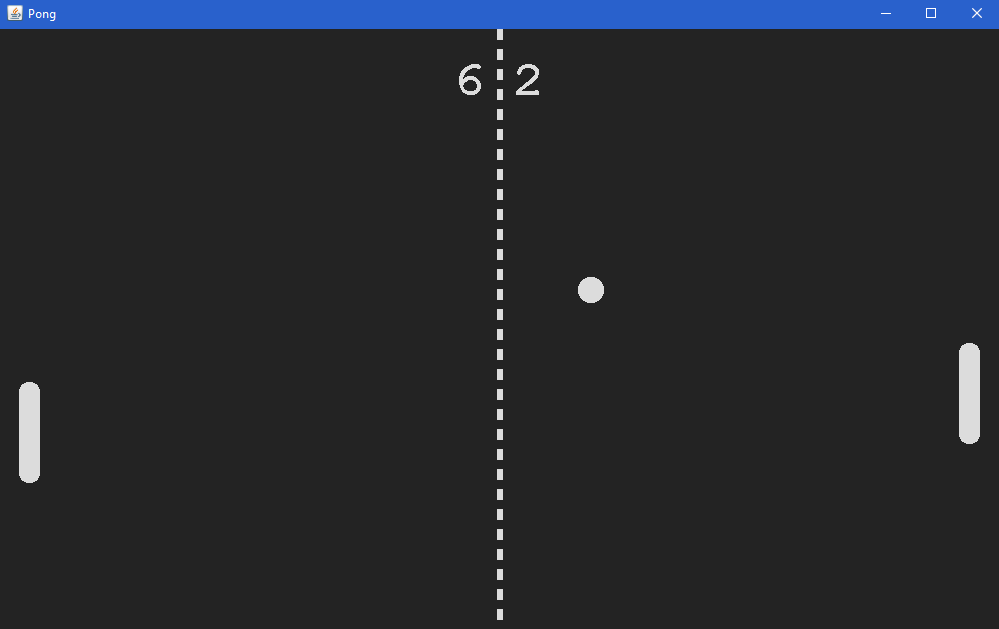

# Pong

Remake of the classic game with customization options for adding variety.

Also works as a beautiful simulation when computer controls both of the paddles.

You can set these options using _PongConfiguration.ini_ file after building
(Hard-coding options into code is not necessary).

## Customizations & Features

* Set how many frames appear in one second.
* Choose how many pixels the elements move in one second by default.
(If you want to change the speed of all elements,
change this otherwise use that element's speed multiplier.)
* Select the background color (color of the elements is the inverse of this color).
* Choose the size of the board.
* Specify the sizes and the speed multipliers of ball and both paddles.
* Specify the bounce angle from the paddle.
* Select the game type.
  1. User controls left and right paddles.
  2. User controls left and computer controls right paddle.
  3. Computer controls left and right paddles.
* Choose the control type (mouse or keyboard).
* Specify the label size (text of scores and pause and line for dividing the board).
* Choose the ball behaviour when it misses the paddle.
  1. Ball starts from middle.
  2. Ball continues and bounces from edge.
* Reset the ball by pressing _R_.
* Pause the game by pressing _P_.
* Pausing automatically when window loses focus.

## Controls

* If user controls left and right paddles
  * With mouse
    * Left paddle moves when mouse is in the left half of the board.
    * Right paddle moves when mouse is in the right half of the board.
  * With keyboard
    * Left paddle
      * Moves up by pressing _W_.
      * Moves down by pressing _S_.
    * Right paddle
      * Moves up by pressing _UP_.
      * Moves down by pressing _DOWN_.
* If user controls just the left paddle
  * With mouse
    * Left paddle moves when the mouse moves.
  * With keyboard
    * Left paddle moves up by pressing _W_.
    * Left paddle moves down by pressing _S_.

## Installation

Built by NetBeans 8.2 (whole repository is the NetBeans project). Requires ACM Java Libraries.

## Contribution

Feel free to contribute.

## Distribution

You can distribute this software (jar file in the dist folder) freely under GNU GPL v3.0.